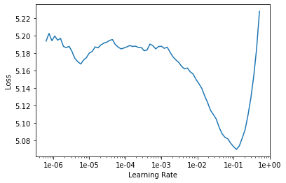
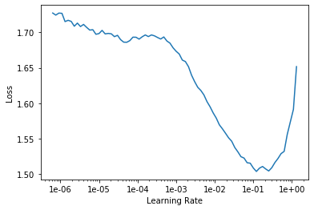

# Language Modeling & Sentiment Analysis of Amazon Product Reviews


In this project I train a sentiment classifier using a dataset that consists of Amazon reviews. The goal of this classifier is to predict the user sentiment (review score from 1 to 5) based on one or more given sentences.

This is a Natural Language Processing (NLP) problem. First I build a language model that is capable of predicting the next word in a sentence. Then I use this language model to build the sentiment classifier.

## Language Model and Sentiment Classifier

In order to build the classifier, we first create a language model using an NLP technique called [transfer learning](https://www.aclweb.org/anthology/N19-5004/).  During transfer learning, we use an existing model that was trained on a bigger dataset.  The dataset used is a cleaned subset of Wikipedia called [Wikitext-103](https://blog.einstein.ai/the-wikitext-long-term-dependency-language-modeling-dataset/), which is a collection of over 100 million tokens extracted from articles on Wikipedia. 

The Wikitext dataset has been trained with a deep learning model that predicts what the next word in a sentence is, with its input being all the words that precede it. The model uses a [recurrent neural network architecture](https://en.wikipedia.org/wiki/Recurrent_neural_network) (RNN), which includes a hidden state that is updated each time it sees a new word. The [hidden state](https://towardsdatascience.com/illustrated-guide-to-recurrent-neural-networks-79e5eb8049c9) contains information about the sentence from all the previous words up to that point. 

This dataset will be used along with the Amazon reviews dataset to create the **language model**. The Wikitext model already understands the English language, but only the type that is used in Wikipedia.  So this model is [fine-tuned](https://blog.fastforwardlabs.com/2018/12/28/finetuning-for-natural-language-processing.html) with the Amazon dataset so that it learns the type of English used in Amazon reviews. The final language model learns the version of the English language fine-tuned to the style we want and creates a vocabulary that will be used to then build the sentiment classifier.

## Initializing


```python
%reload_ext autoreload
%autoreload 2
%matplotlib inline
```

Importing the fast.ai library


```python
from fastai import *
from fastai.text import *
```


```python
# torch.cuda.set_device(0)
```


```python
# Checking to see if a GPU is installed
torch.cuda.is_available()
```

## The Amazon Reviews Dataset

The dataset can be accessed from the [Standford Snap website](http://snap.stanford.edu/data/web-Amazon.html) . The data spans a period of 18 years, including approximately 35 million reviews from 1995 to March 2013. Reviews include product and user information, ratings, and a plaintext review.

The Amazon reviews dataset was constructed by randomly taking 600,000 training samples and 130,000 testing samples for each review score from 1 to 5. This is a classification problem where each numerical review score is a class. Therefore, there will be 5 classes.  In total there are 3,000,000 training samples and 650,000 testing samples.

## Preparing the data

Let's download the dataset using the fastai library.  With the `untar_data` function, the `URLs` argument, and the fastai dataset name "AMAZON_REVIEWS", it can be easily downloaded and extracted.


```python
path = untar_data(URLs.AMAZON_REVIEWS, dest = "Data")
```

The `path` is the directory where the data is saved.


```python
# Looking at the directory of the saved data.
path.ls()
```


    [PosixPath('Data/amazon_review_full_csv/class-databunch-amazon'),
     PosixPath('Data/amazon_review_full_csv/lm_databunch-amazon'),
     PosixPath('Data/amazon_review_full_csv/models'),
     PosixPath('Data/amazon_review_full_csv/test.csv'),
     PosixPath('Data/amazon_review_full_csv/readme.txt'),
     PosixPath('Data/amazon_review_full_csv/train.csv')]


The files train.csv and test.csv contain the training and testing samples as comma-separated values. There are 3 columns in each file, corresponding to the class index (review score from 1 to 5), the review title and the review text.

## Creating a DataBunch

We will create a text databunch, which is a data object for the language model (data_lm) by using the [data block API](https://docs.fast.ai/data_block.html) from fastai.

First, we'll use the [pandas library](https://en.wikipedia.org/wiki/Pandas_(software)) to import the dataset into our model and create a [Dataframe](https://pandas.pydata.org/pandas-docs/stable/reference/api/pandas.DataFrame.html). A training dataset will be created using the file "train.csv" and a validation dataset will be created using the file "test.csv". The original dataset has 3,000,000 training samples and 650,000 testing samples but for the purposes of saving training time, we will use one third of the data.  As you will see by the end of this model, using 1,000,000+ reviews of data is more than enough to get an accurate sentiment classifier.


```python
path.ls()
```


    [PosixPath('Data/amazon_review_full_csv/test.csv'),
     PosixPath('Data/amazon_review_full_csv/readme.txt'),
     PosixPath('Data/amazon_review_full_csv/train.csv')]


### Training Dataset


```python
train_df = pd.read_csv(path/'train.csv', header=None, names=['Rating', 'Title', 'Review'], skiprows=(2000000))
train_df.head()
```

<table border="1" class="dataframe">
  <thead>
    <tr style="text-align: right;">
      <th></th>
      <th>Rating</th>
      <th>Title</th>
      <th>Review</th>
    </tr>
  </thead>
  <tbody>
    <tr>
      <th>0</th>
      <td>3</td>
      <td>Interesting form.</td>
      <td>Interesting kung fu style-- Combination of Whi...</td>
    </tr>
    <tr>
      <th>1</th>
      <td>4</td>
      <td>Excellent advice on cutting fat &amp; increasing f...</td>
      <td>This is a well organized book with lots of use...</td>
    </tr>
    <tr>
      <th>2</th>
      <td>5</td>
      <td>Wise, practical, and medically sound</td>
      <td>Life is about making choices and owning up to ...</td>
    </tr>
    <tr>
      <th>3</th>
      <td>1</td>
      <td>Starve your kids now so they can be fat later.</td>
      <td>Another book that teaches kids that being bigg...</td>
    </tr>
    <tr>
      <th>4</th>
      <td>3</td>
      <td>If John Sayles adapted a Joseph Wambaugh story...</td>
      <td>Evenhand is a very impressive accomplishment: ...</td>
    </tr>
  </tbody>
</table>
</div>


The first column is the review score, the second column is the review title and the third column is the actual review.


```python
len(train_df) # length of training dataset
```


    1000000


### Validation Dataset


```python
valid_df = pd.read_csv(path/'test.csv', header=None, names=['Rating', 'Title', 'Review'], skiprows=(435000))
valid_df.head()
```

<table border="1" class="dataframe">
  <thead>
    <tr style="text-align: right;">
      <th></th>
      <th>Rating</th>
      <th>Title</th>
      <th>Review</th>
    </tr>
  </thead>
  <tbody>
    <tr>
      <th>0</th>
      <td>3</td>
      <td>product quality good but ivory color not</td>
      <td>I ordered the ivory color of these plates as I...</td>
    </tr>
    <tr>
      <th>1</th>
      <td>5</td>
      <td>made in america</td>
      <td>I currently own six of these sets in different...</td>
    </tr>
    <tr>
      <th>2</th>
      <td>2</td>
      <td>Fiesta Dishes</td>
      <td>I have several place settings of Fiesta Dishes...</td>
    </tr>
    <tr>
      <th>3</th>
      <td>2</td>
      <td>Place setting</td>
      <td>I read the title wrong. I thought I was gettin...</td>
    </tr>
    <tr>
      <th>4</th>
      <td>5</td>
      <td>Excellent reference</td>
      <td>This book is for any mother in the process of ...</td>
    </tr>
  </tbody>
</table>
</div>


```python
len(valid_df) # length of validation dataset
```


    215000


### The Language Model Data Object

Having the training and validation dataframes, we can create a data object for the language model called `data_lm`. The text and target columns are defined by using the arguments text_cols and label_cols, respectively, 


```python
data_lm = TextLMDataBunch.from_df(path=path, train_df=train_df, valid_df=valid_df, text_cols=2, label_cols=0)
```


With the data object created, we can use a few methods to look at our data.

First we can check the length of the vocabulary that was created and the training dataset length.


```python
# The length of the vocabulary and the length of the training dataset.  
# Vocab is capped at 60,000 by default
len(data_lm.vocab.itos), len(data_lm.train_ds)
```


    (60000, 1000000)


Creating a databunch with over a million samples took quite some time, so we'll save our databunch so we can easily access this file later.


```python
data_lm.save('lm_databunch-amazon')
```

The `.show_batch()` method shows a batch of 5 random samples.


```python
data_lm.show_batch()
```


<table border="1" class="dataframe">
  <thead>
    <tr style="text-align: right;">
      <th>idx</th>
      <th>text</th>
    </tr>
  </thead>
  <tbody>
    <tr>
      <td>0</td>
      <td>amazon for making these available to rent ! xxmaj enjoyable for esoteric martial arts video junkies like myself , gives you a chance to see what other styles you 're not likely to find at the local strip mall are doing , and to " try before you buy " . i 've bought several videos from the same company as this one on sale cheap , some are excellent</td>
    </tr>
    <tr>
      <td>1</td>
      <td>world . xxbos xxmaj very mediocre live concert video , it should be better if the concert was taped live , instead too much editing , which diminished the dvd . xxmaj the cd was way much better . xxmaj this is the perfect example of a live concert being screwed by too much editing . xxbos xxup la xxup calidad xxup de xxup sonido xxup es xxup buena y</td>
    </tr>
    <tr>
      <td>2</td>
      <td>cookery . xxmaj the perfect book for someone whose xxup only cooking appliance is a microwave . xxmaj also good for new microwave owners who want to try a variety of recipes . xxmaj while the cooking times given are specifically directed at 440 to 550 " low - wattage " microwaves , these recipes would actually work with any microwave . xxmaj you 'd simply have to use your</td>
    </tr>
    <tr>
      <td>3</td>
      <td>is not a xxunk of proof that xxmaj mr xxmaj jefferson xxunk with xxmaj sally xxmaj hemings , and as a matter of fact , xxmaj hemings and her mother xxmaj betty were promiscuous and had many fathers to their huge xxunk . xxmaj stop smearing xxmaj thomas xxmaj jefferson with this lie .. he gave 40 years of his life to xxmaj america and without his assistance , xxmaj</td>
    </tr>
    <tr>
      <td>4</td>
      <td>trick usually . xxmaj hopefully she 'll get used to the bed and we can remove the rail . xxbos i purchased this bed rail after reading that it is a universal bed rail and does n't need to be used with a box spring . i thought it would be perfect for using with our son 's twin mattress that is on a xxunk board . xxmaj unfortunately ,</td>
    </tr>
  </tbody>
</table>


Let's look at the samples. A text is composed of words, and we can't apply mathematical functions to them directly. We first have to convert them to numbers so we can feed them to our Neural Network. This is done in two different steps: tokenization and numericalization. Above, in the column "text", every word you see is actually a token.

## Tokenization

The first step of processing the text is to split the raw sentences into words, or more exactly tokens. The easiest way to do this would be to split the sentence on every space, but we take it even further.

In NLP, a token is the basic unit of processing. They correspond to words or punctuation, as well as several special tokens, corresponding to unknown words, capitalization, beginning of a sentence, etc. All those tokens starting with "xx" are  special tokens created by the fastai library. The rules for these special tokens are as follow:

- UNK (xxunk) is for an unknown word (one that isn't present in the vocabulary)
- PAD (xxpad) is the token used for padding, if we need to regroup several texts of different lengths in a batch
- BOS (xxbos) represents the beginning of a sentence in your dataset
- FLD (xxfld) is used to separate the different fields of texts (if your texts are loaded from several columns in a dataframe)
- MAJ (xxmaj) is used to indicate the next word begins with a capital letter in the original text
- UP (xxup) is used to indicate the next word is written in all caps in the original text
- REP (xxrep) is used to indicate the next character is repeated n times in the original text
- WREP(xxwrep) is used to indicate the next word is repeated n times in the original text 

## Numericalization

Once we have extracted tokens from our texts, the tokens are converted to integers by creating a list of all of the words used. The list will only keep the tokens that appear at least twice with a maximum vocabulary size of 60,000 (by default) and replace the ones that don't make the cut by the unknown token xxunk.

The vocabulary is a dictionary where each token represents a number. The dictionary starts with the number 0 representing "xxunk".

## Training the Language Model

Loading the previously saved databunch.


```python
data_lm = load_data(path, 'lm_databunch-amazon', bs=192)
```

The code below is used to create a "learner" object that includes an existing model loaded with the Wikitext pre-trained weights. The weights will be downloaded by default the first time you run the following line:


```python
learn_lm = language_model_learner(data_lm, AWD_LSTM, drop_mult=1.)
```

### Model Architecture

The architecture for this model is called AWD-LSTM, which stands for Average Stochastic Gradient Descent Weight-Dropped (AWD) - Long Short Term Memory (LSTM).  It was developed in 2017 and published in [this paper](https://arxiv.org/pdf/1708.02182.pdf). An AWD-LSTM is an [LSTM](https://en.wikipedia.org/wiki/Long_short-term_memory) but with regularization techniques such as [dropout](http://jmlr.org/papers/v15/srivastava14a.html) and optimization techniques such as batch normalization and [Adam](https://towardsdatascience.com/adam-latest-trends-in-deep-learning-optimization-6be9a291375c) applied. An LSTM is a type of RNN that is capable of learning information for a long period inside a given text string.

In the learner object above named `learn_lm`, dropout regularization is applied to each layer using the parameter `drop_multi`. There are 5 different types of dropouts used in an AWD-LSTM. The higher `drop_multi` is, the more dropout is applied throughout. Setting it to "1" gives the default values for AWD-LSTM dropouts according to the paper mentioned above. You can reduce this to a low number like 0.01 to avoid underfitting.

Batch Normalization is also applied to each layer. It normalizes the output (activations) of each layer. It allows us to train deeper networks without the activations getting really big or really small. It subtracts the mean of the activation and divides by the standard deviation.  It has a a set of learnable parameters that gets added and a set that gets multiplied to the normalized activations.

### Finding a Learning Rate

Now, we want to choose a good learning rate. So we plot the learning rate vs the loss to select a good value in which to train the model.


```python
learn_lm.lr_find()
```


    LR Finder is complete, type {learner_name}.recorder.plot() to see the graph.
    


```python
learn_lm.recorder.plot(skip_end=15)
```





We want to select a learning rate that's on the steepest downward slope, but not too close to the end of the slope.


```python
lr = 1e-2 # learning rate
```

### Mixed Precision Training

Instead of the default 32-bit floating point for training, we use half precision floating point (16-bit). NVDIA GPU's run faster on a half precision floating point.


```python
learn_lm.to_fp16();
```

### Training 

To train we use the `fit_one_cycle` method, which makes the learning rate start slow, then go up, then go back down again. It takes as arguments the number of [epochs](https://deepai.org/machine-learning-glossary-and-terms/epoch) (1), the learning rate (`lr`) and `moms`. The argument `moms` adds momentum to the weights to improve the training speed and leads to better convergence. The first number in `moms` corresponds to the earlier layers and the second one is for the last few layers.


```python
learn_lm.fit_one_cycle(1, lr, moms=(0.8,0.7))
```


<table border="1" class="dataframe">
  <thead>
    <tr style="text-align: left;">
      <th>epoch</th>
      <th>train_loss</th>
      <th>valid_loss</th>
      <th>accuracy</th>
      <th>time</th>
    </tr>
  </thead>
  <tbody>
    <tr>
      <td>0</td>
      <td>4.387569</td>
      <td>4.011612</td>
      <td>0.281535</td>
      <td>2:53:56</td>
    </tr>
  </tbody>
</table>


Since it is relatively slow to train (almost 3 hours for 1 epoch), we will save the object with the trained weights so that they can be loaded later.


```python
learn_lm.save('lm-fit_1')
```


```python
learn_lm.load('lm-fit_1');
```

### Fine Tuning

The language model has achieved an accuracy of 28.1%, but this can be improved. Previously, by default, the model was trained with its initial layers frozen, since the weights for those layers were already pre-trained.

Now we will unfreeze all the layers in the model and train again. We launch a new training with more epochs.


```python
learn_lm.unfreeze()
```


```python
learn_lm.fit_one_cycle(5, lr, moms=(0.8,0.7))
```


<table border="1" class="dataframe">
  <thead>
    <tr style="text-align: left;">
      <th>epoch</th>
      <th>train_loss</th>
      <th>valid_loss</th>
      <th>accuracy</th>
      <th>time</th>
    </tr>
  </thead>
  <tbody>
    <tr>
      <td>0</td>
      <td>4.123457</td>
      <td>3.938658</td>
      <td>0.297660</td>
      <td>3:18:02</td>
    </tr>
    <tr>
      <td>1</td>
      <td>4.080691</td>
      <td>3.898088</td>
      <td>0.301613</td>
      <td>3:17:20</td>
    </tr>
    <tr>
      <td>2</td>
      <td>3.966353</td>
      <td>3.789810</td>
      <td>0.312056</td>
      <td>3:17:19</td>
    </tr>
    <tr>
      <td>3</td>
      <td>3.835992</td>
      <td>3.660307</td>
      <td>0.325040</td>
      <td>3:17:13</td>
    </tr>
    <tr>
      <td>4</td>
      <td>3.756566</td>
      <td>3.602239</td>
      <td>0.331414</td>
      <td>3:17:00</td>
    </tr>
  </tbody>
</table>


And now the accuracy has improved.


```python
learn_lm.save('lm-fine_tuned')
```

### Encoder

We have to save not just the model but also it's encoder, the part that's responsible for creating and updating the hidden state. An encoder takes an input (sentence) and outputs a vector representation of that sentence. Then the classifier takes the representation and turns it into a prediction.


```python
learn_lm.save_encoder('lm-fine_tuned_enc')
```

We save the encoder to be able to use it for the classification section later.

## Generating Fake Amazon Product Reviews 

### Loading our saved model


```python
learn_lm.load('lm-fine_tuned');
```

### Language Model Predictions

How good is our model? Well let's try to see what it predicts after a few given words. To evaluate the language model, we run the `learn_lm.predict` method by specifying an input string and the number of tokens we want it to guess.


```python
learn_lm.predict("I liked this product because", 40, temperature=0.75)
# The temperature is the level of randomness
```


    "I liked this product because i like all the parts that it 's made of and may be Super Easy to use . i 'm a fan of all of the Dakota Chan movies though . i 'm not too sure"


```python
learn_lm.predict("This product was", 30, temperature=0.75)
```


    'This product was not as described . It was not the same as the picture . More like a basic product and not what i was looking for . xxbos'


```python
learn_lm.predict("This product was terrible because", 30, temperature=0.75)
```


    'This product was terrible because it was so thin it was so hard to clean . It had been wearing out for about 2 months and then we had to throw it away .'


These sentences would not make that much sense to a human, but note that they still respect basic grammar rules, which come from the pre-trained Wikitext model.

## Building a Classifier

Now, we'll create a new data object or DataBunch for the sentiment classifier. You can see that it uses the vocabulary `data_lm.train_ds.vocab` that was created when we built the language model DataBunch. 


```python
data_clas = TextClasDataBunch.from_df(path, train_df=train_df, valid_df=valid_df, text_cols=2,
                                      label_cols=0, vocab=data_lm.train_ds.vocab, bs=96)
```


 Again, since this line took a bit of time, we'll save it so we can load it in the future.


```python
data_clas.save('class-databunch-amazon')
```


```python
data_clas = load_data(path, 'class-databunch-amazon', bs=96)
```


```python
data_clas.show_batch()
```


<table border="1" class="dataframe">
  <thead>
    <tr style="text-align: right;">
      <th>text</th>
      <th>target</th>
    </tr>
  </thead>
  <tbody>
    <tr>
      <td>xxbos xxup gc xxup sux ! xxup gc xxup sux ! xxup gc xxup sux ! xxup gc xxup sux ! xxup gc xxup sux ! xxup gc xxup sux ! xxup gc xxup sux ! xxup gc xxup xxunk xxup sux ! xxup gc xxup sux ! xxup gc xxup sux ! xxup gc xxup sux ! xxup gc xxup sux ! xxup gc xxup sux ! xxup gc</td>
      <td>1</td>
    </tr>
    <tr>
      <td>xxbos i xxup was xxup in xxup new xxup york xxup city a xxup few xxup months xxup and i xxup saw a xxup stand xxup set xxup up xxup with a xxup devil xxup baby , xxup it xxup was a xxup rubber xxup baby xxup but xxup it xxup caught xxup my xxup eye xxup none xxup the xxup less . xxup when i xxup went xxup to</td>
      <td>5</td>
    </tr>
    <tr>
      <td>xxbos xxmaj album : xxmaj time xxmaj life - xxmaj ultimate xxmaj love xxmaj songs - xxmaj when a xxmaj man xxmaj loves a xxunk : xxmaj various xxunk : xxunk xxmaj xxunk xxmaj love xxmaj xxunk . xxmaj you 're the xxmaj inspiration - xxmaj xxunk . xxmaj have i xxmaj told xxmaj you xxmaj lately - xxmaj rod xxmaj xxunk . i xxmaj want to xxmaj know xxmaj</td>
      <td>3</td>
    </tr>
    <tr>
      <td>xxbos xxmaj smackdown pay - per - views always seem to be much more lackluster than the xxmaj raw ones . xxmaj this event is no exception . xxmaj there are few strong matches . xxup the xxup event * xxmaj tag xxmaj titles : xxup mnm ( c ) vs. xxmaj paul xxmaj london &amp; xxmaj brian xxmaj kendrick . xxmaj this was xxup mnm 's last match before</td>
      <td>3</td>
    </tr>
    <tr>
      <td>xxbos i bought this lens over a year ago with great expectations . i used it a lot but was not impressed with the images near 200 mm and wide open . i was told that this lens does have a steep learning curve so i persisted . i decided to check for back / front focusing . i focused on the center line ( xxmaj camera on tripod ,</td>
      <td>2</td>
    </tr>
  </tbody>
</table>


We can then create a learner object using the classifier databunch to classify those reviews and load the encoder we saved before.


```python
learn_c = text_classifier_learner(data_clas, AWD_LSTM, drop_mult=1)
```

Below we load the saved encoder and add it into our classifier learner object.


```python
learn_c.load_encoder('lm-fine_tuned_enc')
```


    RNNLearner(data=TextClasDataBunch;
    
    Train: LabelList (1000000 items)
    x: TextList
    xxbos xxmaj interesting kung fu xxunk xxmaj combination of xxmaj white xxmaj crane and xxmaj wing xxmaj chun ? xxmaj the practitioners seem to have solid stances and not a lot of superfluous or wasted movement . xxmaj would like to have seen more applications xxunk just a couple in the last few minutes of the video , basically an arm lock and a push . xxmaj thanks to xxmaj amazon for making these available to rent ! xxmaj enjoyable for esoteric martial arts video junkies like myself , gives you a chance to see what other styles you 're not likely to find at the local strip mall are doing , and to " try before you buy " . i 've bought several videos from the same company as this one on sale cheap , some are excellent , some are lousy , this one is in the middle . xxmaj not recommended for people wanting to learn self defense because a ) self defense applications are not spelled out clearly , and b ) even if they were , a live teacher and a lot of realistic training is needed to make any system work in real life .,xxbos xxmaj this is a well organized book with lots of useful advice and good dietary recommendations . i just have two complaints : 1 ) xxmaj there is an assumption that heavy kids are heavy because they eat junk food and do n't exercise . i 'm living with a heavy kid who rarely eats junk food and has always exercised a lot . xxmaj this message is frustrating , to say the least . 2 ) xxmaj the title is a problem . xxmaj my daughter is already hyper - sensitive about her weight , were i to buy this book ( i read it at the library ) , the title itself would confirm to her that i find her " fat . " xxmaj in fact , i would purchase this book , were it not for the title because it is among the best of the books covering the subject , and i 've read a number of them . i appreciate the books emphasis on physical fitness . i think a person who is physically fit has a better life and feels better in every way . xxmaj parents have an obligation to promote such well being as far as i 'm concerned .,xxbos xxmaj life is about making choices and owning up to them . xxmaj too many kids in xxmaj america are fat . xxmaj this did n't used to be so . xxmaj times have changed . xxmaj here is advise on motivating yourself and your kids . xxmaj setting a good example , teaching them how to make proper choices , and educating them for a healthy life . xxmaj does n't neglect exercise . xxmaj good recipes . xxmaj does n't require counting fat or calories , just being smart . xxmaj put away your guilt and become a leader in your household , here 's how . xxmaj your kids and grandkids will thank you for generations .,xxbos xxmaj another book that teaches kids that being bigger is a personal defect caused by personal weakness , and too much eating . xxmaj if you just quit doing ' this ' and stop doing ' that ' you can be just like the other kids . xxmaj complete drivel . a waste of money . xxmaj find a book that will teach your children about the value of being different , not one that tries to scare them into starved conformity .,xxbos xxmaj xxunk is a very impressive accomplishment : a quiet , thoughtful cop film . xxmaj its premise is familiar : two very different personalities working to adapt to each other and to the many demands of their jobs as xxunk . xxmaj so it 's very much a character study , and the two principal actors -- xxmaj bill xxmaj sage and xxmaj bill xxmaj xxunk -- do an excellent job of realizing their characters . xxmaj as the film 's energy is derived from their characters ' different natures , it would have been very easy for each of their performances to become xxunk . xxmaj they did not . xxmaj in each , you see a fully - dimensioned person , including echoes of his partner 's traits . xxmaj that 's good acting of good writing . i also enjoyed the matter - of - fact style of the film , which reminded me of xxmaj victor xxmaj xxunk 's wonderful and under - appreciated xxmaj ruby xxmaj in xxmaj paradise .
    y: CategoryList
    3,4,5,1,3
    Path: Data/amazon_review_full_csv;
    
    Valid: LabelList (215000 items)
    x: TextList
    xxbos i ordered the ivory color of these plates as i wanted something neutral but not completely white . xxmaj the ivory color is more of a yellow color so i sent them back . xxmaj overall , i loved the dishes and the fact that they are made in the xxup usa and are lead - free . i will buy them again but find a color that works for me .,xxbos i currently own six of these sets in different colors . xxmaj these plates are heavy and well made . xxmaj worth the price . xxmaj my buffet now looks like something out of a xxmaj wes xxmaj anderson movie .,xxbos i have several place settings of xxmaj fiesta xxmaj dishes . i ordered 2 more place settings recently and was dissapointed with them . xxmaj the dishes are warped and do n't stack well with my other dishes . xxmaj these dishes are apparently rejects . i love the idea of the xxmaj fiesta brand but these were not like my others .,xxbos i read the title wrong . i thought i was getting a setting for four . xxmaj one of the cups came chipped and i made a note of it on here . i never got a response . i decided to keep it . i am not going to buy any more sets . i saw a few days ago at xxmaj kohls , they have the same set . xxmaj it was probally cheaper with your xxmaj kohls discounts .,xxbos xxmaj this book is for any mother in the process of divorce . xxmaj unlike one reviewer , i thought the author did an excellent job of explaining everything a mother needs to consider . xxmaj the tips were so helpful ... so many things i had n't thought of ! xxmaj it gave me insight into my children 's needs , and insight into alimony , custody , and child support , choosing an attorney , etc . i believe i got a much better settlement because of this book , and it gave me piece of mind to read the stories of the women it detailed . i bought several books to try to educate myself , but this one was the best by far . xxmaj it covers so many topics . xxmaj it should be recommended reading by attorneys , xxunk , and marriage counselors .
    y: CategoryList
    3,5,2,2,5
    Path: Data/amazon_review_full_csv;
    
    Test: None, model=SequentialRNN(
      (0): MultiBatchEncoder(
        (module): AWD_LSTM(
          (encoder): Embedding(60000, 400, padding_idx=1)
          (encoder_dp): EmbeddingDropout(
            (emb): Embedding(60000, 400, padding_idx=1)
          )
          (rnns): ModuleList(
            (0): WeightDropout(
              (module): LSTM(400, 1152, batch_first=True)
            )
            (1): WeightDropout(
              (module): LSTM(1152, 1152, batch_first=True)
            )
            (2): WeightDropout(
              (module): LSTM(1152, 400, batch_first=True)
            )
          )
          (input_dp): RNNDropout()
          (hidden_dps): ModuleList(
            (0): RNNDropout()
            (1): RNNDropout()
            (2): RNNDropout()
          )
        )
      )
      (1): PoolingLinearClassifier(
        (layers): Sequential(
          (0): BatchNorm1d(1200, eps=1e-05, momentum=0.1, affine=True, track_running_stats=True)
          (1): Dropout(p=0.4, inplace=False)
          (2): Linear(in_features=1200, out_features=50, bias=True)
          (3): ReLU(inplace=True)
          (4): BatchNorm1d(50, eps=1e-05, momentum=0.1, affine=True, track_running_stats=True)
          (5): Dropout(p=0.1, inplace=False)
          (6): Linear(in_features=50, out_features=5, bias=True)
        )
      )
    ), opt_func=functools.partial(<class 'torch.optim.adam.Adam'>, betas=(0.9, 0.99)), loss_func=FlattenedLoss of CrossEntropyLoss(), metrics=[<function accuracy at 0x7f26cf76cb00>], true_wd=True, bn_wd=True, wd=0.01, train_bn=True, path=PosixPath('Data/amazon_review_full_csv'), model_dir='models', callback_fns=[functools.partial(<class 'fastai.basic_train.Recorder'>, add_time=True, silent=False)], callbacks=[RNNTrainer
    learn: ...
    alpha: 2.0
    beta: 1.0], layer_groups=[Sequential(
      (0): Embedding(60000, 400, padding_idx=1)
      (1): EmbeddingDropout(
        (emb): Embedding(60000, 400, padding_idx=1)
      )
    ), Sequential(
      (0): WeightDropout(
        (module): LSTM(400, 1152, batch_first=True)
      )
      (1): RNNDropout()
    ), Sequential(
      (0): WeightDropout(
        (module): LSTM(1152, 1152, batch_first=True)
      )
      (1): RNNDropout()
    ), Sequential(
      (0): WeightDropout(
        (module): LSTM(1152, 400, batch_first=True)
      )
      (1): RNNDropout()
    ), Sequential(
      (0): PoolingLinearClassifier(
        (layers): Sequential(
          (0): BatchNorm1d(1200, eps=1e-05, momentum=0.1, affine=True, track_running_stats=True)
          (1): Dropout(p=0.4, inplace=False)
          (2): Linear(in_features=1200, out_features=50, bias=True)
          (3): ReLU(inplace=True)
          (4): BatchNorm1d(50, eps=1e-05, momentum=0.1, affine=True, track_running_stats=True)
          (5): Dropout(p=0.1, inplace=False)
          (6): Linear(in_features=50, out_features=5, bias=True)
        )
      )
    )], add_time=True, silent=False)


## Training the Sentiment Classifier

Just like when we trained the language model, we first find the best learning rate. Then we train with the initial layers frozen. Then we unfreeze all the layers and train the model again.


```python
learn_c.lr_find()
```


    LR Finder is complete, type {learner_name}.recorder.plot() to see the graph.
    


```python
learn_c.recorder.plot()
```





```python
learn_c.fit_one_cycle(2, 1e-2, moms=(0.8,0.7))
```


<table border="1" class="dataframe">
  <thead>
    <tr style="text-align: left;">
      <th>epoch</th>
      <th>train_loss</th>
      <th>valid_loss</th>
      <th>accuracy</th>
      <th>time</th>
    </tr>
  </thead>
  <tbody>
    <tr>
      <td>0</td>
      <td>1.170253</td>
      <td>1.027700</td>
      <td>0.547135</td>
      <td>28:45</td>
    </tr>
    <tr>
      <td>1</td>
      <td>1.171571</td>
      <td>1.004947</td>
      <td>0.558605</td>
      <td>31:51</td>
    </tr>
  </tbody>
</table>


Again we save after our first training run.


```python
learn_c.save('class-first')
```


```python
learn_c.load('class-first');
```

The learner method `.freeze_to(-2)` below freezes all the layers in the model except for the last 2.

Instead of passing one learning rate to the training method, we pass two by using "slice".  The first one is for the initial layers and the second one is for the last few layers.


```python
learn_c.freeze_to(-2)
learn_c.fit_one_cycle(1, slice(1e-2/(2.6**4),1e-2), moms=(0.8,0.7))
```


<table border="1" class="dataframe">
  <thead>
    <tr style="text-align: left;">
      <th>epoch</th>
      <th>train_loss</th>
      <th>valid_loss</th>
      <th>accuracy</th>
      <th>time</th>
    </tr>
  </thead>
  <tbody>
    <tr>
      <td>0</td>
      <td>1.023225</td>
      <td>0.919875</td>
      <td>0.596679</td>
      <td>37:36</td>
    </tr>
  </tbody>
</table>


```python
learn_c.save('class-2nd')
```


```python
learn_c.load('class-2nd');
```

Now we train again with all the layers frozen except for the last 3.


```python
learn_c.freeze_to(-3)
learn_c.fit_one_cycle(1, slice(1e-2/(2.6**4),1e-2), moms=(0.8,0.7))
```


<table border="1" class="dataframe">
  <thead>
    <tr style="text-align: left;">
      <th>epoch</th>
      <th>train_loss</th>
      <th>valid_loss</th>
      <th>accuracy</th>
      <th>time</th>
    </tr>
  </thead>
  <tbody>
    <tr>
      <td>0</td>
      <td>1.037800</td>
      <td>0.920161</td>
      <td>0.597009</td>
      <td>1:19:05</td>
    </tr>
  </tbody>
</table>


```python
learn_c.save('class-3rd')
```


```python
learn_c.load('class-3rd');
```

Now we train again with all the layers unfrozen. With this part we finish the fine-tuning.


```python
learn_c.unfreeze()
learn_c.fit_one_cycle(5, slice(1e-3/(2.6**4), 1e-3), moms=(0.8,0.7))
```


<table border="1" class="dataframe">
  <thead>
    <tr style="text-align: left;">
      <th>epoch</th>
      <th>train_loss</th>
      <th>valid_loss</th>
      <th>accuracy</th>
      <th>time</th>
    </tr>
  </thead>
  <tbody>
    <tr>
      <td>0</td>
      <td>1.027829</td>
      <td>0.917155</td>
      <td>0.599019</td>
      <td>1:46:11</td>
    </tr>
    <tr>
      <td>1</td>
      <td>1.032029</td>
      <td>0.914616</td>
      <td>0.598893</td>
      <td>1:50:14</td>
    </tr>
    <tr>
      <td>2</td>
      <td>1.022771</td>
      <td>0.906662</td>
      <td>0.602981</td>
      <td>1:46:32</td>
    </tr>
    <tr>
      <td>3</td>
      <td>1.006938</td>
      <td>0.904673</td>
      <td>0.604344</td>
      <td>1:30:16</td>
    </tr>
    <tr>
      <td>4</td>
      <td>1.013143</td>
      <td>0.903782</td>
      <td>0.604563</td>
      <td>1:46:58</td>
    </tr>
  </tbody>
</table>


Even though the accuracy is only 60%, you will see below that the classifier is very accurate.  The reason why it's only 60% here is because many times an Amazon review with the same sentiment in words will result in different review scores.

For example, for a written review of *\"I liked this product\"*, the most likely review score would be a 4.  But different reviewers would have chosen either a 4 or a 5 for the score.  Even though most reviews that use the word *like* will tend to produce a score if 4, there are still many reviewers who just *liked* a product but they scored it a 5 or even a 3 in some cases.

Likewise, for a written review of "*This product was OK*", you will have real reviews score of 2, 3, or 4 for the same sentiment in written text.  This phenomenon is reflected in the validation data we used.  The model uses real review scores and text from Amazon.

If this model solved a binary classification problem where it would **only** have to guess between a "yes" or a "no" for *\"I liked the product\"* or *\"I didn't like the product\"*, the accuracy percentage that you would see here would be around the mid 90's. 

So you will not see a high accuracy score against a validation set when you have 5 different sentiment classes because real humans will sometimes give different review scores for the same sentiment, but the predicted score for this model will be fairly accurate when we input our own text string.


```python
learn_c.save('classification')
```

## Results and Sentiment Analysis

Now we can see how good is our sentiment classifier.  The `.predict` method from the `learn_c` object outputs a predicted review score when given a particular text string.  


```python
learn_c.predict("I really loved that shirt, it fit perfectly.")
```


    (Category 5, tensor(4), tensor([0.0037, 0.0090, 0.0294, 0.3770, 0.5809]))


The program outputs the category, which is the review score, and a tensor with the probabilities for each score.

In this case, the program outputs a review score of 5, which is what we would expect for a review of *\"I really loved that shirt\"*.


```python
learn_c.predict("I didn't really like the table, it was ugly.")
```


    (Category 2,
     tensor(1),
     tensor([1.2331e-01, 5.6617e-01, 3.0470e-01, 5.6670e-03, 1.4611e-04]))


A review score of 2 is a very accurate prediction.  The person *\"didn't like\"* the product, but he didn't *hate* it.


```python
learn_c.predict("I hated the book. It was boring")
```


    (Category 1,
     tensor(0),
     tensor([5.9715e-01, 3.7773e-01, 2.4871e-02, 2.2394e-04, 2.4926e-05]))


Again we get an accurate review score of 1.


```python
learn_c.predict("The mp3 player was OK. A bit mediocre")
```


    (Category 3,
     tensor(2),
     tensor([7.7113e-03, 1.5443e-01, 8.0531e-01, 3.2120e-02, 4.3342e-04]))


A *\"medicore\"* review rightfully predicts a score of 3.


```python
learn_c.predict("You get what you pay for.")
```


    (Category 2,
     tensor(1),
     tensor([3.5086e-01, 4.5163e-01, 1.9296e-01, 4.2490e-03, 3.0084e-04]))


*\"You get what you pay for.\"* is most often a negative review. Looking at the tensor of probabilities, the review score of *1* came as a close second.


```python
learn_c.predict("Works as expected.")
```


    (Category 4,
     tensor(3),
     tensor([5.4212e-05, 5.8154e-04, 8.5585e-02, 6.6417e-01, 2.4961e-01]))


*\"Works as expected."* is a positive review, but not as positive as someone who *loved* the product.  A score of 4 came in first with a probability of 66%, and a score of 5 came second with 25%.

## Try it yourself

You can run this model yourself by using the jupyter notebook [here](https://github.com/mlsmall/NLP-Sentiment-Analysis-of-Amazon-Reviews/blob/master/Sentiment%20Analysis%20of%20Amazon%20Reviews.ipynb). You will need a GPU to run it.  I ran this notebook with an Nvidia Tesla P4 GPU and it took 10+ hours of training.
